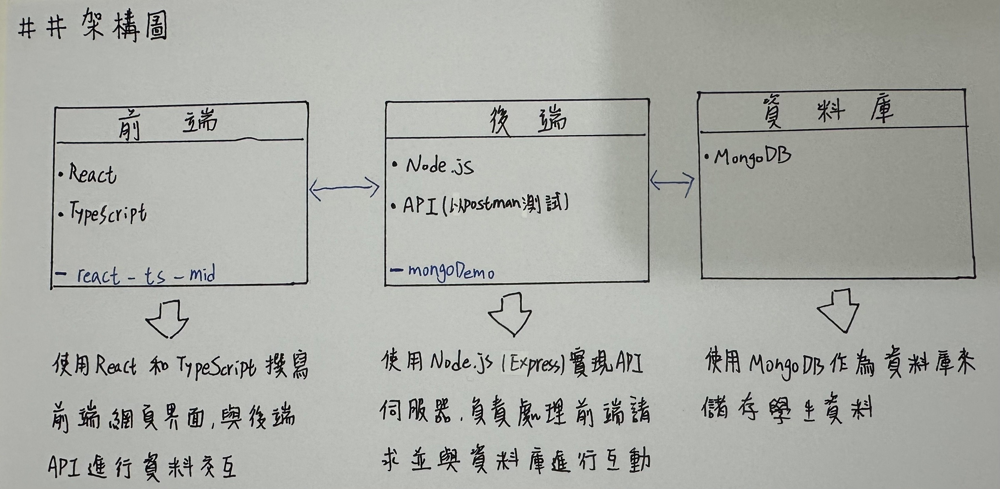
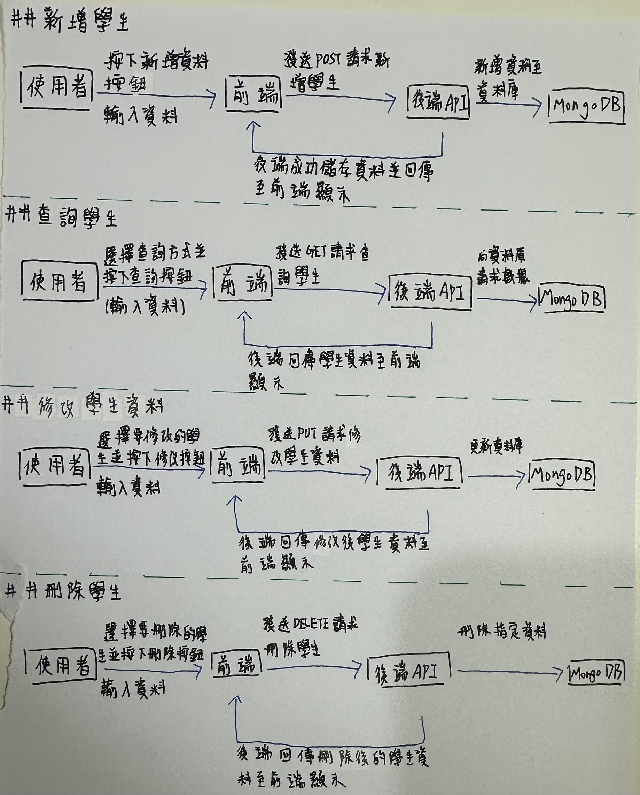

# 學生管理系統

這是一個基於 React 和 TypeScript 的學生管理系統，支持新增、刪除、修改學生資料，並提供按條件查詢學生的功能。

## 安裝與執行指引

### 1. 克隆專案

```bash
前端: git clone https://github.com/hua0731/react-ts-mid.git
後端: git clone https://github.com/hua0731/mongoDemo.git
```

### 2. 安裝依賴

專案使用了 `npm` 來管理依賴，請根據自己的環境安裝所需的依賴。

```bash
npm install

```

### 3. 啟動專案

啟動專案後，應該可以在瀏覽器中訪問前端界面，並與後端進行互動。

```bash
npm run dev
```

此命令會啟動 React 開發伺服器，並在 `http://localhost:5173` 開啟你的應用程式。

### 4. 後端啟動

如果後端是使用 `Node.js` 和 `Express` 創建的，請進行以下操作啟動後端伺服器：

```bash
npm run dev
```

後端伺服器將會運行在指定的端口（例如：`http://localhost:5173`）。

---

## API 規格說明

以下是專案中使用的 API 規格，支援各種 CRUD 操作。

### 1. 查詢所有學生

- **請求方式**: `GET`
- **請求 URL**: `/api/students`
- **回應範例**:

```json
{
  "code": 200,
  "message": "成功",
  "body": [
    {
    "_id": "63b9ff2adf1c93e9a48e1234",
    "userName": "user123",
    "sid": "12345",
    "name": "王小明",
    "department": "資訊工程",
    "grade": "3",
    "class": "A",
    "Email": "user123@example.com",
    "absences": "5"
    }
    // More students...
  ]
}
```

### 2. 新增學生

- **請求方式**: `POST`
- **請求 URL**: `/api/students`
- **請求體**: 

```json
 {
    "_id": "63b9ff2adf1c93e9a48e1234",
    "userName": "user123",
    "sid": "12345",
    "name": "王小明",
    "department": "資訊工程",
    "grade": "3",
    "class": "A",
    "Email": "user123@example.com",
    "absences": "5"
    }
```

- **回應範例**:

```json
{
  "code": 200,
  "message": "學生資料已成功新增"
}
```

### 3. 刪除學生

- **請求方式**: `DELETE`
- **請求 URL**: `/api/students/{id}`
- **請求參數**: 
  - `id` (學生 ID)
  
- **回應範例**:

```json
{
  "code": 200,
  "message": "學生資料已成功刪除"
}
```

### 4. 更新學生姓名

- **請求方式**: `PUT`
- **請求 URL**: `/api/students/{id}`
- **請求體**:

```json
{
  "name": "New Name"
}
```

- **回應範例**:

```json
{
  "code": 200,
  "message": "學生資料已成功更新"
}
```
---

### 5. 架構圖
以下是本專案的系統架構圖：


### 6. 流程圖
以下是本專案的 CRUD 流程圖：
